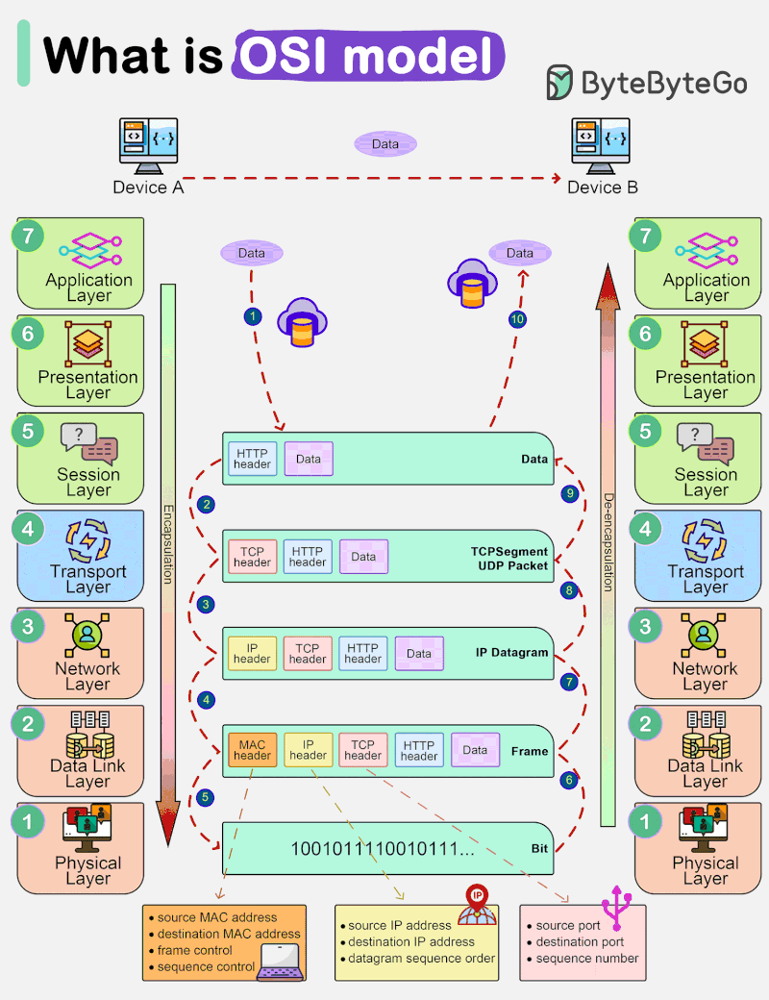
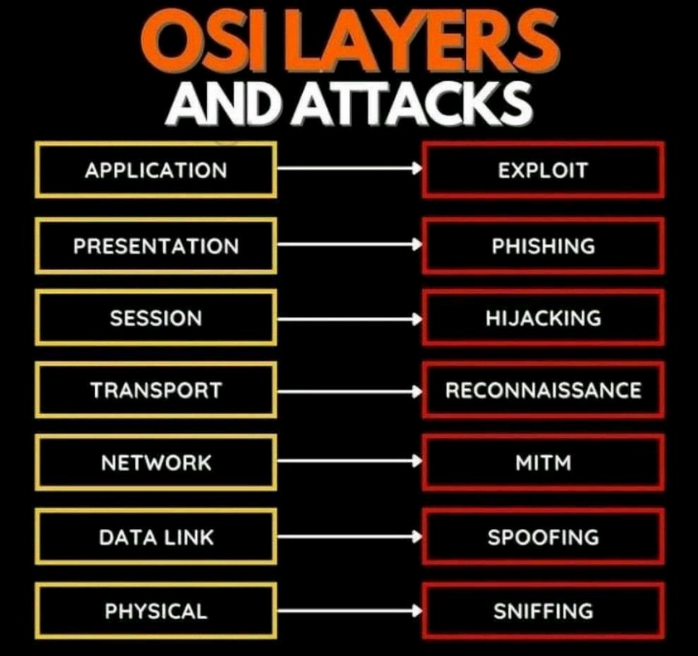

[Common HTTP status code](https://github.com/2aman-0x/networks/blob/main/CommonHttpStatusCode)

### The OSI Model from a Cybersecurity Perspective

| OSI layers | Functions | Attack Vectors |
| ----- | ------|  ------|
| Application | - user Interface & app-level service   - Web Browsing, email, file transfer   -  HTTP, SMTP, DNS probals | - Malware injection   - Phishing Attack   - App-level DDoS Attacks
| Presentation | - Data encryption and decryption   - Data compression and expasion   - Data format conversion | - Attack for weak encryption   - File format exploits   - Malicious code injection
| Session | - Create & Terminate app sessions   - Manage session state   - Video conferencing ression   | - Session Hijacking & replay   - Session fixation attack   - Cross-site request forgery
| Transport | - End-to-end data delivery   - TCP and UDP protocals   - Firmare correction & congestion control | - TCP/SYN & UDP flood attack   - TCP hijacking & MiTM attak   - Port scan for vulnerability
| Network | - Routing and IP addressing   - IPv4, IPv6 and routing protocals   - IP networks configuration | - IP spoofing & fregmentation   - Ping of death & ICMP flood   - Route poisoning attacks  
| Datalink | - Frames and physical addressing   - Error detection and correction   - Switching and VLAN configuration | - ARP spoofing & poisoning   - STP attack & MAC spoofing   - Wireless vulnerability attacks
| Physical | - Electrical/optical signaling   - Ethernet cables and fiber optics   - Physical layer configuration | - Wire tapping and tampering   - Signal jamming   - Unauthorized device install

